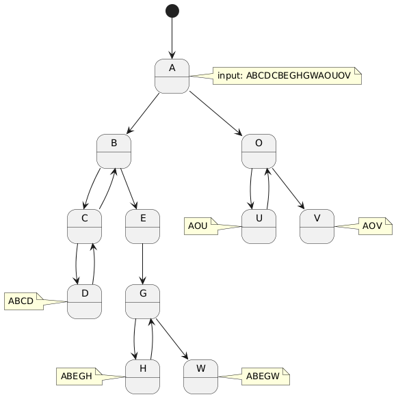

# Maximal Forward References
## Purpose
Implements to MFF Algorithm described in
> [1] Ming-Syan Chen, Jong Soo Park, and P. S. Yu, “Data mining for path traversal patterns in a web environment,” in Proceedings of 16th International Conference on Distributed Computing Systems, Hong Kong: IEEE Comput. Soc. Press, 1996, pp. 385–392. doi: 10.1109/ICDCS.1996.507986.

the MFF class properly decodes the input into forward references:

<!-- https://www.plantuml.com/plantuml/png/NP0nheCm44JxESNMN-8255-iRMHthcmNKOf8WGI9G4JC_KCM6bCzpTCKizjyyct9wsl4DEUEbk7np3Jtn5JJCBtNN1ChRRHghRE9VV0HbxyhLTK_CLYee8GQMcXWYgpeABHeXHPMwE2AdC123oyC24MEs5UENIyZ3UthIkl4RdjF9wN3fx8UVjg7KpcAZMYwwRvzvmi0 -->

> Seeing, that the use case will have to deal with loops, it must be evaluated, if this is the correct approach
> 
> BUT: the MFF outputs could maybe lead to singular features: certain validator states (ie. errors), input options,...!!